# Exercise Library Foundation

## Current Inventory

Before this foundation, the workout catalog lived entirely in local app code:

| Surface | Existing source | Notes |
| --- | --- | --- |
| Workout selection list | `data/exercises.ts` | 25 hard-coded exercises and filter tags |
| Workout preset (`push-strength-day`) | `screens/WorkoutScreen.tsx` | Referenced mock exercise ids that matched local slugs |
| Exercise card UI | `components/ExerciseCard.tsx` | Rendered local `Exercise` name, type, and muscles |
| Search and filter UI | `components/SearchBar.tsx`, `components/FilterChips.tsx` | Only filtered the local array |
| Exercise details | None | The app only had a tutorial WebView search inside the active workout flow |
| Shared exercise type | `types/index.ts` | Minimal shape: `id`, `name`, `type`, `muscles`, `tags` |

There were no bundled exercise GIF/video assets and no existing Supabase exercise tables.

## ER Diagram

```mermaid
erDiagram
  muscles ||--o{ exercise_muscles : links
  exercises ||--o{ exercise_muscles : targets
  equipment ||--o{ exercise_equipment : links
  exercises ||--o{ exercise_equipment : requires
  exercises ||--o{ exercise_aliases : has

  muscles {
    uuid id PK
    text code UK
    text name
    text muscle_group
    text body_region
  }

  equipment {
    uuid id PK
    text code UK
    text name
    text category
  }

  exercises {
    uuid id PK
    text slug UK
    text name
    text exercise_type
    text movement_pattern
    text mechanic
    text difficulty
    text laterality
    text primary_tracking_metric
    text load_type
    text[] instructions
    text[] program_focuses
    text source
    boolean is_active
  }

  exercise_muscles {
    uuid exercise_id FK
    uuid muscle_id FK
    text role
    smallint sort_order
  }

  exercise_equipment {
    uuid exercise_id FK
    uuid equipment_id FK
    text requirement_type
    smallint sort_order
  }

  exercise_aliases {
    uuid id PK
    uuid exercise_id FK
    text alias
    text alias_type
    smallint sort_order
  }
```

## Authoritative Data Rule

Supabase is now the authoritative exercise definition source for the workout catalog.

Local files may still contain:

- UI filter definitions
- preset workout slug references
- presentation-only helpers

Local files must not remain a second exercise database. The old `data/exercises.ts` dataset has been removed now that the workout UI is wired to Supabase.

## Database Model

This foundation adds:

- `muscles`
- `equipment`
- `exercises`
- `exercise_muscles`
- `exercise_equipment`
- `exercise_aliases`
- `search_exercises(...)`

No `exercise_media` table was added in this stage because the current workout UI only needs:

- a single app-side icon placeholder on cards
- the existing tutorial WebView search flow inside the active workout experience

That keeps Metro-safe asset behavior intact and avoids pretending the app already has a real managed video library.

The seeded starter catalog currently contains:

- 21 muscles
- 12 equipment entries
- 56 exercises
- normalized muscle and equipment relations
- exercise aliases such as `RDL`

Stable exercise UUIDs are seeded alongside stable human-readable slugs so future workout plans, workout logs, PR tables, and substitution systems can reference exercises without schema redesign.

## Exercise Fields

Important `exercises` fields:

- `id`: stable UUID for every future foreign key
- `slug`: stable human-readable identifier for routes and seed idempotency
- `name`: canonical display name
- `description`: concise internal ONE UP copy
- `instructions`: ordered display steps for the detail screen
- `exercise_type`: `strength`, `cardio`, or `mobility`
- `movement_pattern`: programming-friendly movement category
- `mechanic`: `compound`, `isolation`, or `isometric`
- `difficulty`: `beginner`, `intermediate`, or `advanced`
- `laterality`: `bilateral`, `unilateral`, or `alternating`
- `primary_tracking_metric`: how future workout logging should track it
- `load_type`: how the exercise is loaded in future workout logging
- `program_focuses`: programming-ready goals such as `strength` or `hypertrophy`
- `source`: provenance marker, currently `oneup_internal`
- `sort_order`: curated ordering for predictable catalog display
- `is_active`: soft-visibility control so historical references stay safe

## Taxonomy

### Muscle Groups

The normalized muscle catalog uses user-facing groups rather than an overly anatomical graph:

- `chest`
- `back`
- `shoulders`
- `arms`
- `legs`
- `core`

Each muscle also stores a `body_region`:

- `upper`
- `lower`
- `core`

### Movement Patterns

The current seed uses:

- `horizontal_push`
- `vertical_push`
- `horizontal_pull`
- `vertical_pull`
- `squat`
- `hinge`
- `lunge`
- `anti_rotation`
- `anti_extension`
- `flexion`
- `isolation`

The field remains nullable so future exercises are not forced into a bad classification.

### Exercise Types

This stage supports:

- `strength`
- `cardio`
- `mobility`

The seed currently uses `strength` and `cardio`.

### Difficulty

The current controlled set is:

- `beginner`
- `intermediate`
- `advanced`

### Laterality

The current controlled set is:

- `bilateral`
- `unilateral`
- `alternating`

### Tracking Metrics

Future workout logging can safely branch on:

- `weight_reps`
- `bodyweight_reps`
- `duration`
- `distance_duration`
- `reps_only`

### Load Types

Future workout logging can safely branch on:

- `external_weight`
- `bodyweight`
- `bodyweight_plus_load`
- `assisted`
- `duration`
- `distance_duration`

## Search + Filtering

`search_exercises(...)` supports:

- name search
- alias search
- prefix matching
- typo-tolerant trigram matching
- muscle-group filtering
- body-region filtering
- equipment filtering
- exercise-type filtering
- difficulty filtering
- movement-pattern filtering
- program-focus filtering

The workout screen now uses this RPC instead of filtering a local array.

Search behavior is intentionally layered:

- exact canonical-name lookup
- exact alias lookup
- prefix matching
- simple full-text token prefix matching
- trigram-based typo tolerance for reasonable near-matches

Examples validated in the current verifier:

- `bench`
- `squat`
- `row`
- `curl`
- `rdl`
- `lateral raise`
- typo query `benchh`

## Equipment Model

Exercises can reference more than one equipment row through `exercise_equipment`.

Examples:

- Bench Press -> `barbell` + `bench`
- Pull-Up -> `bodyweight` + `pullup_bar`
- Seated Cable Row -> `cable`

`requirement_type` supports:

- `required`
- `optional`
- `alternative`

This stage uses explicit `bodyweight` equipment because it makes future filtering simpler than a separate equipment-free flag.

## Muscle Model

Primary and secondary muscles live in `exercise_muscles` with ordered rows.

- `primary` captures the main target muscles
- `secondary` captures meaningful supporting muscles

This avoids brittle columns such as `secondary_muscle_1` and keeps compound lifts flexible enough for multiple primary muscles later if needed.

## Aliases

Aliases live in `exercise_aliases` and are searchable through the same RPC.

Current examples include:

- `RDL` -> Romanian Deadlift
- `Bike` -> Stationary Bike
- `Skull Crusher` -> Lying Triceps Extension

## Media Handling

No database media table was added in this stage.

Current workout media behavior remains intentionally simple:

- exercise cards use the existing icon placeholder
- active workout tutorial playback still uses a YouTube search WebView derived from the selected exercise name

This avoids breaking Metro with dynamic `require()` behavior and leaves room for a future `exercise_media` table only if the product actually adopts multiple managed assets per exercise.

## RLS

Master exercise-library tables are readable to authenticated users, including anonymous guest sessions, but writable only through privileged/admin paths.

Current policies allow authenticated users to:

- read `muscles`
- read `equipment`
- read active `exercises`
- read relationships/aliases for active exercises

Authenticated users cannot:

- insert exercises
- update exercises
- delete exercises
- edit muscles
- edit equipment

The verifier explicitly checks read success plus insert/update/delete failure for a normal authenticated user.

## Source / Provenance

The seeded exercise catalog is internal ONE UP content marked as `oneup_internal`.

This stage does not scrape or clone proprietary exercise databases. The exercise names, descriptions, and instructions were authored as concise internal seed content for architecture validation, not copied from Hevy, Strong, Fitbod, Nike Training Club, MuscleWiki, or similar commercial sources.

## Future Workout Compatibility

This schema is designed so later systems can safely reference `exercises.id` without redesign:

- `workout_plan_exercises.exercise_id`
- `workout_session_exercises.exercise_id`
- `workout_sets.exercise_id`
- future PR/comparison tables keyed by exact exercise variation

Because Barbell Bench Press, Dumbbell Bench Press, Incline Barbell Bench Press, and Incline Dumbbell Press are separate exercises, future PR logic will not accidentally merge unlike movements.

Because `load_type` and `primary_tracking_metric` already exist, future workout logging can distinguish:

- external-load strength lifts
- bodyweight lifts
- assisted bodyweight lifts
- duration-based movements
- distance-and-time cardio

## Remaining Mock Dependencies

The exercise catalog itself is now Supabase-backed, but a few workout behaviors intentionally remain local because this task stops at the library layer:

- active workout set rows are still local screen state
- selected exercise state is still local screen state
- tutorial playback still uses the existing app-side YouTube search WebView
- workout completion does not persist sets, reps, or history yet

## Future Extensions Not Built Yet

These were intentionally left for later stages:

- `exercise_media`
- `exercise_relations`
- workout plans
- workout session logging
- PR tracking
- exercise substitutions
- recommendation logic

## Profile Equipment Compatibility

Profile and onboarding currently store broad workout locations:

- `home`
- `gym`
- `both`

Those values should stay broad for now. They are not forced into exercise requirements directly.

Future workout programming can map them into capability sets, for example:

- `home` -> bodyweight + limited home equipment
- `gym` -> full equipment access
- `both` -> union of home and gym capabilities

That translation is intentionally deferred so this task does not redesign the profile model.
