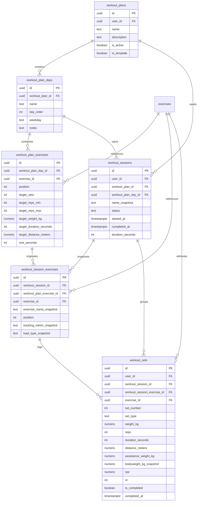

# Workout Plans + Logging Foundation

## Overview

The Workout system now separates:

- planned training structure
- actual performed workout history

This preserves immutable history even when plans change later.

## ER Diagram

## Planned Model

`workout_plans`

- user-owned routine container
- supports multiple plans per user
- `is_active` keeps archival separate from hard deletion

`workout_plan_days`

- ordered days inside a plan
- `day_order` is sequencing
- `weekday` is optional calendar intent

`workout_plan_exercises`

- references authoritative `exercises.id`
- stores structured targets instead of `"8-12"` text
- supports reps, load, duration, and distance targets

## Actual Session Model

`workout_sessions`

- one row per started workout
- may be planned or ad hoc
- supports `in_progress`, `completed`, and `cancelled`
- only one `in_progress` session per user is allowed

`workout_session_exercises`

- snapshots exercise name, tracking metric, and load type
- keeps nullable provenance back to `workout_plan_exercises`
- remains readable even if plan rows later change or disappear

`workout_sets`

- authoritative performed data
- stores raw values for future PRs and Progress
- keeps planned target snapshots alongside actual values

## Planned vs Actual

Starting a planned day now does this atomically:

1. create `workout_sessions`
2. snapshot plan exercises into `workout_session_exercises`
3. initialize `workout_sets`

Editing a plan later does not mutate prior sessions because completed history reads from session snapshot rows, not the current plan.

## Metric + Load Support

Supported tracking metrics:

- `weight_reps`
- `bodyweight_reps`
- `reps_only`
- `duration`
- `distance_duration`

Supported load types:

- `external_weight`
- `bodyweight`
- `bodyweight_plus_load`
- `assisted`
- `duration`
- `distance_duration`

This allows:

- bench press with `weight_kg + reps`
- push-ups with `bodyweight_kg_snapshot + reps`
- weighted pull-ups with `bodyweight_kg_snapshot + weight_kg`
- assisted pull-ups with `bodyweight_kg_snapshot + assistance_weight_kg`
- planks with `duration_seconds`
- treadmill/cardio with `distance_meters + duration_seconds`

## Canonical Units

Stored canonically:

- weight in kilograms
- distance in meters
- duration in seconds

Displayed from Profile preference:

- metric: `kg`, `m`
- imperial: `lb`, `mi`

The Workout screen converts display inputs before writing to Supabase.

## Bodyweight Snapshot

For bodyweight-relevant exercises, `workout_sets.bodyweight_kg_snapshot` is captured from the current Profile weight when the session starts. This keeps future performance interpretation stable even if the user bodyweight changes later.

## Session Lifecycle

States:

- `in_progress`
- `completed`
- `cancelled`

Current lifecycle:

1. start planned or custom session
2. persist set edits with debounce plus blur/complete flushing
3. resume active session after navigation or reload
4. complete or cancel the session

Skipped sets remain present as incomplete rows rather than being silently deleted.

## Security

All workout tables are private.

Protected by RLS:

- plans scoped to `user_id = auth.uid()`
- child plan rows scoped through parent ownership
- sessions scoped to `user_id = auth.uid()`
- child session rows scoped through parent ownership
- set writes validated against the owning session and session exercise

Transactional RPCs:

- `save_workout_plan(...)`
- `start_workout_session(...)`
- `complete_workout_session(...)`
- `cancel_workout_session(...)`

These use `auth.uid()` inside security-definer functions and do not trust arbitrary client user ids.

## Current UI Integration

The existing Workout design stays intact:

- exercise search and selection remain
- Home push-day preset now starts a real plan-backed session
- active sets now persist to `workout_sets`
- active sessions resume from Supabase
- Complete Workout now finalizes persisted history

Minimal additions were made only where persistence required them:

- resume-active-workout banner
- save/retry sync messaging
- dynamic set columns for duration, distance, and bodyweight variants

## Future Progress Compatibility

The model is ready for later queries such as:

- exercise history over time
- weekly sets per muscle
- completed workouts per week
- future estimated 1RM and rep PR calculations
- future volume analytics

Those future systems should read from:

`workout_sets -> workout_session_exercises -> exercises -> exercise_muscles`

No Progress, PR, XP, streak, or analytics UI is implemented in this stage.
